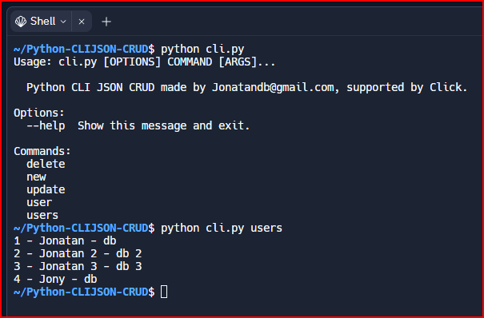

# Python CLI JSON CRUD supported by [Click](https://click.palletsprojects.com).

    

## Live preview
- https://replit.com/@Jonatandb/Python-CLIJSON-CRUD
### Setting up the project folder
> python -m venv venv

### Activating the environment
> source venv/Scripts/activate

### Installing the dependencies
> pip install -r requirements.txt

### Running the application
> python cli.py

---
- [x] User listing:
  > python cli.py users
- [x] User search by ID:
  > python cli.py user 1
  - 1 is the ID of the user to search for.
- [x] User creation:
  > python cli.py new --name SomeName --lastname SomeLastname
  - --name and --lastname are required.
- [x] User deletion:
  > python cli.py delete 1
  - 1 is the ID of the user to be deleted.
- [x] User modification:
  > python cli.py update 1 --name newName --lastname newLastname
  - 1 is the ID of the user to be modified.
  - --name must be follow for a string.
  - --lastname must be follow for a string.
  - --name and --lastname can be provided separately as well.
---

### Investigated sites
 - [Click documentation](https://click.palletsprojects.com/en/8.1.x/)
 - [Github Markdown - Sintaxis de escritura y formato básicos](https://docs.github.com/es/get-started/writing-on-github/getting-started-with-writing-and-formatting-on-github/basic-writing-and-formatting-syntax)